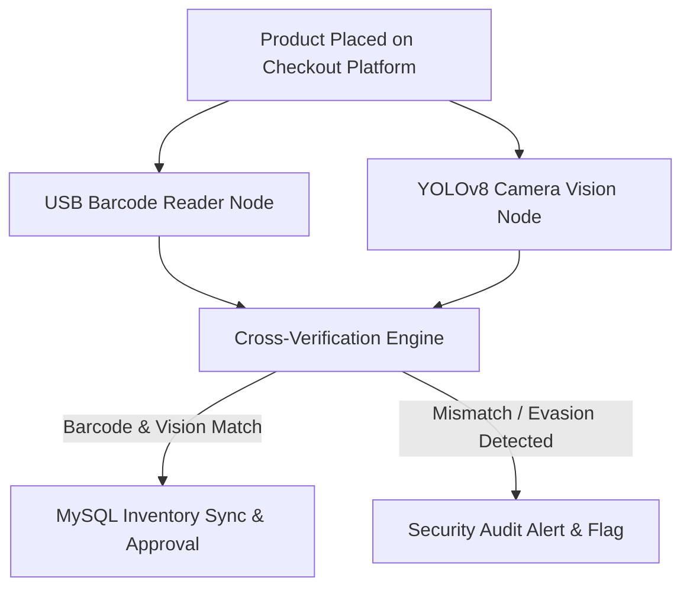

# 🚀 MUHAMMAD IRFAN FAHMI — Computer Engineering Portfolio & AI Agent

[](https://l3al3y.github.io/Portfolio/)
[](certificates/)
[](certificates/)
[](certificates/)

> **Official Personal Engineering Portfolio & Agent-Native Application** for **MUHAMMAD IRFAN FAHMI BIN SAMSUL KAMAR**, a Computer Engineering Technology graduate specializing in Network Engineering, IT Infrastructure, Cyber Security, Computer Vision, and Industrial AI.

---

## 🌐 Quick Links & Live Application

- 🔗 **Live Web Portfolio**: [https://l3al3y.github.io/Portfolio/](https://l3al3y.github.io/Portfolio/)
- 📄 **Official PDF Resume**: [resume/resume.pdf](resume/resume.pdf)
- 📜 **Verified Certifications**: [certificates/](certificates/)

---

## 👨‍💻 Candidate Profile

```text
Name:           MUHAMMAD IRFAN FAHMI BIN SAMSUL KAMAR
Target Roles:   Network Engineer | IT Infrastructure | IT Support | Cyber Security | AI Automation | Embedded Systems
Education:      Bachelor of Computer Engineering Technology (Computer Systems) with Honours — UTeM
                Diploma in Electronic Engineering (Computer) — Politeknik Port Dickson
Certifications: Cisco CCNA (Enterprise Networking, Switching, Routing & Wireless)
                Festo Industrial Automation with AI
                Cisco Endpoint Security & Cyber Threat Management
Location:       Puchong, Selangor, Malaysia (Open to On-site, Hybrid, Relocation & Outstation)
Military:       Askar Wataniah (Territorial Army Reserve — High Discipline & Stress Resilience)
```

---

## 🛒 Featured Capstone Project Spotlight

### **Hybrid Self-Checkout System (Computer Vision + Barcode Integration)**

Designed to prevent item evasion and fraud in automated self-checkout systems by cross-referencing visual object detection against physical barcode scans in real time.



#### **Key Technical Achievements & Verified Benchmarks:**
- 🧠 **Dual Verification Engine:** Integrates YOLOv8 PyTorch model with OpenCV live camera feed, USB barcode scanner (serial HID interface), and MySQL database synchronization.
- 📊 **Verified Metrics at 50 Epochs:**
  - **77.4% Precision** *(Custom local product dataset)*
  - **72.0% Recall** *(50 Epochs training)*
  - **<90ms Real-Time Camera Inference Latency**
- 📹 **Split-View Camera Fusion:** Conducted dual-view camera placement experiments to eliminate product occlusion and mitigate false negatives during scanning.

---

## 🛠️ Core Engineering Capabilities

| Domain | Key Skills & Technologies |
|---|---|
| **Networking & Infrastructure** | Cisco CCNA, OSPF, VLAN, Inter-VLAN Routing, STP, EtherChannel, TCP/IP, Wireshark, Cisco Packet Tracer, Fiber Optic Splicing |
| **IT Support & Operations** | Workstation Assembly, PC Maintenance, Windows Administration, Driver Deployment, Technical Documentation, User Support |
| **Cybersecurity** | Cisco Endpoint Security, Cyber Threat Management, Host Hardening, Firewall ACLs, Threat Mitigation, Cloudflare Turnstile |
| **Computer Vision & AI** | Python, OpenCV, YOLOv8 PyTorch, Model Fine-Tuning, Dataset Preparation, Real-Time Video Stream Inference |
| **Hardware & IoT** | Microcontrollers, Arduino, ESP32, Sensors (HX711, Load Cells), EasyEDA Schematic Design, Embedded C/C++ Firmware |

---

## 🛡️ Privacy & Contact Protection

Candidate phone and email contact details are protected behind **Cloudflare Turnstile CAPTCHA human verification** and edge proxy infrastructure, preventing automated web scraping while offering direct access to recruiters.

---

© 2026 **Muhammad Irfan Fahmi Bin Samsul Kamar** · Built with HTML5, Vanilla CSS3, JavaScript & Autonomous Agent Engineering.
