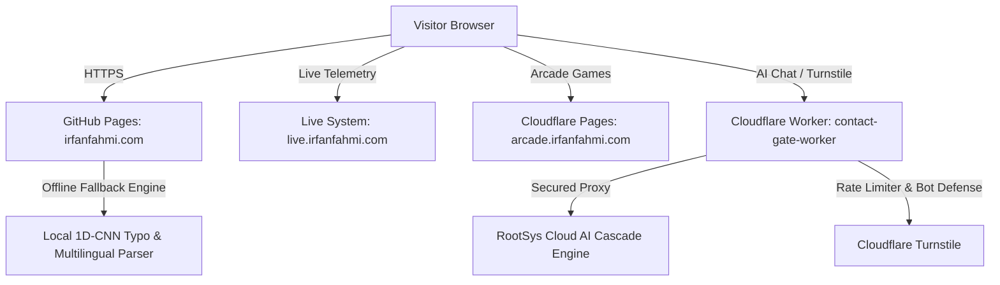

# Muhammad Irfan Fahmi — Engineering Portfolio

<p align="center">
  <strong>Computer Engineering Graduate · Cisco CCNA Certified · AI & Edge Systems Builder</strong>
</p>

<p align="center">
  <a href="https://irfanfahmi.com"></a>
  <a href="https://live.irfanfahmi.com"></a>
  <a href="https://irfanfahmi.com/manga.html"></a>
  <a href="https://arcade.irfanfahmi.com"></a>
  <a href="https://linkedin.com/in/mifi99"></a>
</p>

<p align="center">
  
  
  
  
  
  
  
  
</p>

---

## 🌟 Executive Summary

**Muhammad Irfan Fahmi** is a Computer Engineering graduate from **Universiti Teknikal Malaysia Melaka (UTeM)** with a solid foundation in **Electronic Engineering (Computer)** from **Politeknik Port Dickson** and **Best Student Award** honors from **Kolej Komuniti Selandar**.

He bridges **hardware, enterprise networking, computer vision, and autonomous AI systems** to build resilient, real-world engineering solutions.

- 🌐 **Primary Portfolio:** [irfanfahmi.com](https://irfanfahmi.com)
- ⚡ **Live Telemetry Dashboard:** [live.irfanfahmi.com](https://live.irfanfahmi.com)
- 🎮 **Mini Arcade Platform:** [arcade.irfanfahmi.com](https://arcade.irfanfahmi.com)
- 📄 **Verified Resume:** [`resume/resume.pdf`](resume/resume.pdf)
- 🏅 **Credential Registry:** [`certificates/registry.json`](certificates/registry.json) (25 verified records)

---

## 🚀 Featured Engineering Projects (Proof of Work)

### 1. 🤖 [Parliament of Minds](https://irfanfahmi.com#projects) — Autonomous Multi-Model Consensus AI Agent
An enterprise-grade, 24/7 autonomous multi-model AI agent running on edge hardware with live telemetry at **[live.irfanfahmi.com](https://live.irfanfahmi.com)**.
- **Architecture:** Eliminates AI hallucinations using a consensus governance layer with 5 decision modes and adversarial cross-checking before executing actions.
- **Live System Telemetry:** Live dashboard deployed at [live.irfanfahmi.com](https://live.irfanfahmi.com).
- **Open Source Contribution:** Successfully contributed and merged into [`ashishpatel26/500-AI-Agents-Projects`](https://github.com/ashishpatel26/500-AI-Agents-Projects) (36.2k★) via **PR #167**.
- **Key Capabilities:** Continuous telemetry monitoring, multi-model cascade voting, and automated self-healing.

### 2. 👁️ [Hybrid Self-Checkout System](https://irfanfahmi.com#projects) — Computer Vision & Barcode Fusion (Capstone)
A dual-verification retail automation prototype designed to eliminate barcode scan evasion and item swapping.
- **Deep Learning Model:** Custom-trained **YOLOv8 PyTorch** model fine-tuned for 50 epochs on local Malaysian retail items.
- **Verified Benchmark:** **77.4% Precision**, **72.0% Recall**, and **under 90ms** real-time camera inference latency.
- **Hardware Integration:** Dual split-view camera occlusion mitigation, serial HID USB barcode reader, and real-time MySQL inventory synchronization.

### 3. 📖 [IrfanLLM Manga Controller](https://irfanfahmi.com/manga.html) — Edge AI Touchless Reading Assistant
A zero-touch, hands-free manga and webtoon reading controller running directly at the edge in your browser via front camera. Developed to scroll webtoons and turn pages while eating without touching greasy screens.
- **Computer Vision & ML Pipeline:** 21 3D landmarks extracted at 30–60 FPS via **MediaPipe Hands JS**, feeding a custom-trained **100-tree Scikit-Learn Random Forest** classifier compiled to a 14.6 KB pure JavaScript array traversal.
- **Verified Benchmark:** **100.0% Model Precision**, **0.0% recoil false positives** (eliminating the return-stroke flaw of velocity heuristics), **0.30s hysteresis lock**, and **<0.1ms** inference latency per frame.
- **Pure WebRTC Resilience:** Native `getUserMedia` with 3-tier fallback constraints, hardware lifecycle management (`track.stop()`), and full mobile compliance (`playsinline`, `webkit-playsinline`).
- **DemonicScans Bookmarklet:** Runs on any manga/webtoon website with a clean 1-line script bookmarklet:
  ```javascript
  javascript:(function(){const s=document.createElement('script');s.src='https://irfanfahmi.com/manga.js';document.head.appendChild(s);})();
  ```
- **Live Demo:** Try it now at [irfanfahmi.com/manga.html](https://irfanfahmi.com/manga.html).

### 4. 🎮 [Mini Arcade](https://arcade.irfanfahmi.com) — Interactive Browser Game Platform
A live, responsive browser gaming suite deployed globally on Cloudflare Edge with ultra-low latency (<60ms).
- **AI Tic Tac Toe:** Powered by the classic **Minimax decision-tree algorithm** for optimal AI moves.
- **Soccer Penalty Shootout:** Real-time physics and shot timing mechanics.
- **Sports Memory Match:** Interactive visual pattern matching card game.
- **Stack:** React, TypeScript, Tailwind CSS, TanStack Router, Cloudflare Pages.

### 5. ⚡ [IoT Livestock Weight Tracking System](https://irfanfahmi.com#projects) — INOTEK 2025 Award Winner
An industrial IoT automation platform awarded **3rd Place at INOTEK 2025**.
- **Hardware & Sensing:** Custom load platform built with **Arduino** and calibrated **HX711** strain-gauge amplifiers.
- **Performance:** Achieved **98%+ measurement precision** in dynamic livestock environments.

---

## 📜 Official Certifications & Credentials (25 Records)

All certificates are digitally verifiable with official documentation in [`certificates/`](certificates/):

| Category | Credential Title | Issuer / Authority | Date |
| :--- | :--- | :--- | :--- |
| **Networking** | **CCNA:** Enterprise Networking, Security, & Automation | Cisco Networking Academy / UTeM | Feb 2026 |
| **Networking** | **CCNA:** Switching, Routing, and Wireless Essentials | Cisco Networking Academy / UTeM | Feb 2026 |
| **Industrial AI** | **Festo Professional Certificate:** Industrial Automation with AI | Festo Didactic | Jul 2026 |
| **Cybersecurity** | **Endpoint Security** Certification | Cisco Networking Academy | Dec 2024 |
| **Cybersecurity** | **Cyber Threat Management** Certification | Cisco Networking Academy | Nov 2024 |
| **Fiber Optics** | **Fiber Optic Splicing & Polishing** Workshop | Technical Workshop | Feb 2018 |
| **Gov Upskilling** | **7x Rakyat Digital Credentials** (Agentic AI, AI Visionary, AI Safety, Cloud, Cybersecurity, GenAI, Quantum) | Kementerian Digital Malaysia | 2026 |

---

## 🏗️ System Architecture

The portfolio utilizes a **zero-cost, ultra-fast, edge-first serverless architecture**:



- **Frontend (`Portfolio`):** Pure Vanilla HTML5, modern CSS3 (Glassmorphism, Dark/Light Themes, Mobile Bottom Dock), and optimized ES6+ JavaScript.
- **Live Telemetry (`live.irfanfahmi.com`):** Real-time monitoring dashboard for autonomous agents and edge systems.
- **Mini Arcade (`arcade.irfanfahmi.com`):** Interactive browser games suite powered by Minimax AI.
- **Backend Edge Proxy ([`Portfolio-Backend`](https://github.com/l3al3y/Portfolio-Backend)):** Cloudflare Worker handling rate-limited AI completion routing (`/v1/chat/completions`) and Turnstile contact gate verification.
- **Offline Reliability:** Built-in 1D-CNN character feature extractor and multilingual response generator ensure the AI chatbot responds immediately even during network downtime.

---

## 💻 Local Development Setup

Clone the repository and launch a local web server:

```bash
# Clone the repository
git clone https://github.com/l3al3y/Portfolio.git
cd Portfolio

# Run via Python built-in server
python -m http.server 8000

# Or run via Node / npx
npx serve .
```

Open `http://localhost:8000` in your browser.

---

## 📂 Project Structure

```
Portfolio/
├── index.html                  # Core portfolio markup & SEO meta tags
├── manga.html                  # Interactive touchless reader demo & bookmarklet guide
├── manga.js                    # Compiled 100-tree Random Forest edge vision controller
├── style.css                   # Glassmorphism styling, animations & mobile dock
├── app.js                      # AI representative router, 3D explorer & UI logic
├── CNAME                       # Custom domain mapping (irfanfahmi.com)
├── certificates/               # PDF credentials & digital certificates
│   └── registry.json           # 25 verified certificate records
├── resume/                     # Official engineering resume
│   └── resume.pdf
└── assets/                     # Media, icons, and diagrams
```

---

## 📬 Contact & Connect

- 🌐 **Website:** [irfanfahmi.com](https://irfanfahmi.com)
- ⚡ **Live Telemetry:** [live.irfanfahmi.com](https://live.irfanfahmi.com)
- 🎮 **Mini Arcade:** [arcade.irfanfahmi.com](https://arcade.irfanfahmi.com)
- 💼 **LinkedIn:** [linkedin.com/in/mifi99](https://linkedin.com/in/mifi99)
- 🐙 **GitHub:** [github.com/l3al3y](https://github.com/l3al3y)
- 📍 **Location:** Klang Valley, Malaysia *(Open to On-site, Hybrid, Remote & Relocation)*

---

<p align="center">
  <sub>Built with engineering precision. Muhammad Irfan Fahmi &copy; 2026.</sub>
</p>
