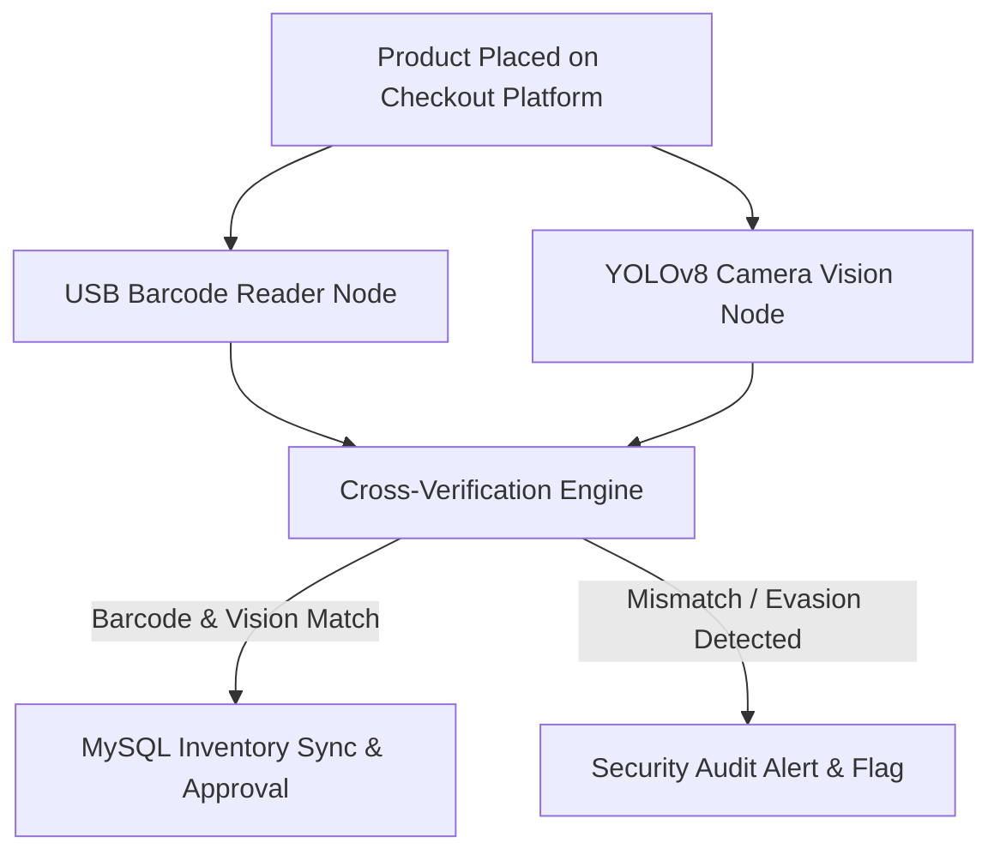

# 🚀 MUHAMMAD IRFAN FAHMI — Computer Engineering Portfolio & AI Assistant

[](https://l3al3y.github.io/Portfolio/)
[](certificates/)
[](certificates/)
[](certificates/)

> **Official Personal Engineering Portfolio** for **MUHAMMAD IRFAN FAHMI BIN SAMSUL KAMAR** — Computer Engineering Technology graduate specializing in Network Engineering, IT Infrastructure, Cyber Security, Computer Vision, and Industrial AI.

---

## 🌐 Quick Links

| | Link |
|---|---|
| 🔗 **Live Portfolio** | [https://l3al3y.github.io/Portfolio/](https://l3al3y.github.io/Portfolio/) |
| 📄 **Resume (PDF)** | [resume/resume.pdf](resume/resume.pdf) |
| 📜 **18 Certificates** | [certificates/](certificates/) |

---

## 👨‍💻 Candidate Profile

```text
Name:           MUHAMMAD IRFAN FAHMI BIN SAMSUL KAMAR
Target Roles:   Network Engineer | IT Infrastructure | IT Support | Cyber Security | AI Automation
Degree:         Bachelor of Computer Engineering Technology (Computer Systems) with Honours — UTeM
Diploma:        Diploma in Electronic Engineering (Computer) — Politeknik Port Dickson
Certificate:    Sijil Sistem Komputer dan Rangkaian — Kolej Komuniti Selandar (Best Student Award)
Certifications: Cisco CCNA (Enterprise Networking, Switching, Routing & Wireless)
                Festo Industrial Automation with AI
                Cisco Endpoint Security & Cyber Threat Management
Languages:      Bahasa Melayu (Native), English (Fluent)
Location:       Puchong, Selangor, Malaysia (Open to On-site, Hybrid, Relocation & Outstation)
Military:       Askar Wataniah (Territorial Army Reserve)
```

---

## ✨ Portfolio Features

### 🤖 AI-Powered Career Assistant
- **Multilingual chatbot** supporting English, Malay, Chinese, Tamil + Malaysian dialects (Kelantan, Northern, Nogori)
- **CNN Typo Correction Engine** — real-time 1D convolutional neural network with phonetic mapping and n-gram scoring for instant typo recovery (e.g., "osfp" → OSPF, "pyton" → Python)
- **Multi-Model AI Pipeline** — 5-provider failover chain (RootSys → NVIDIA Nemotron → GPT-OSS → Gemma-4) via Cloudflare Worker backend
- **Offline-First Knowledge Base** — 70+ resume Q&A topics answered instantly without API calls

### 🔒 Security & Privacy
- **Cloudflare Turnstile** human verification protecting contact details from scrapers
- **Server-side rate limiting** (10 chat/min, 5 turnstile/min per IP)
- **XSS protection** with `escapeHtml()` sanitization on all user inputs

### 🎨 Design & UX
- **Glassmorphism UI** with adaptive Dark/Light theme engine
- **3D Three.js constellation** background with battery-saving tab pause
- **Skip-to-content** accessibility link + `prefers-reduced-motion` support
- **SEO optimized** — Open Graph, Twitter Card, canonical URL, hreflang tags

### 📜 Certificate Registry
- **18 verified certificates** with interactive modal preview and category filtering
- Canonical data store (`certificates/registry.json`) with dynamic rendering

---

## 🛒 Capstone Project — Hybrid Self-Checkout System

Cross-references visual detection against barcode scans to prevent fraud in automated checkout.



**Verified Benchmarks:**
- 🧠 YOLOv8 + OpenCV + USB barcode + MySQL dual verification
- 📊 **77.4% Precision** · **72.0% Recall** · **<90ms inference latency**
- 📹 Split-view camera fusion experiments to eliminate product occlusion

---

## 🛠️ Tech Stack

| Layer | Technologies |
|---|---|
| **Frontend** | HTML5, Vanilla CSS3 (Glassmorphism), JavaScript, Three.js |
| **AI Engine** | CNN Typo Corrector, Intent Classifier, Multi-Model Router |
| **Backend** | Cloudflare Workers, Turnstile, Rate Limiter |
| **AI Providers** | RootSys Cloud (GLM-5.1), OpenRouter (Nemotron, GPT-OSS, Gemma-4) |
| **Deployment** | GitHub Pages, Cloudflare Edge |

---

## 🛠️ Core Engineering Skills

| Domain | Key Skills |
|---|---|
| **Networking** | Cisco CCNA, OSPF, VLAN, STP, EtherChannel, TCP/IP, Wireshark, Fiber Optic Splicing |
| **IT Support** | Workstation Assembly, PC Maintenance, Windows Admin, Driver Deployment |
| **Cybersecurity** | Endpoint Security, Threat Management, Firewall ACLs, Host Hardening |
| **Computer Vision** | Python, OpenCV, YOLOv8 PyTorch, Model Fine-Tuning, Real-Time Inference |
| **Hardware & IoT** | Arduino, ESP32, HX711 Sensors, EasyEDA, Embedded C/C++ |

---

## 🛡️ Privacy & Contact Security

Contact details are protected behind **Cloudflare Turnstile CAPTCHA** and edge proxy infrastructure, preventing automated scraping while offering direct recruiter access.

---

© 2026 **Muhammad Irfan Fahmi Bin Samsul Kamar** · Built with HTML5, Vanilla CSS3, JavaScript & Cloudflare Workers.
