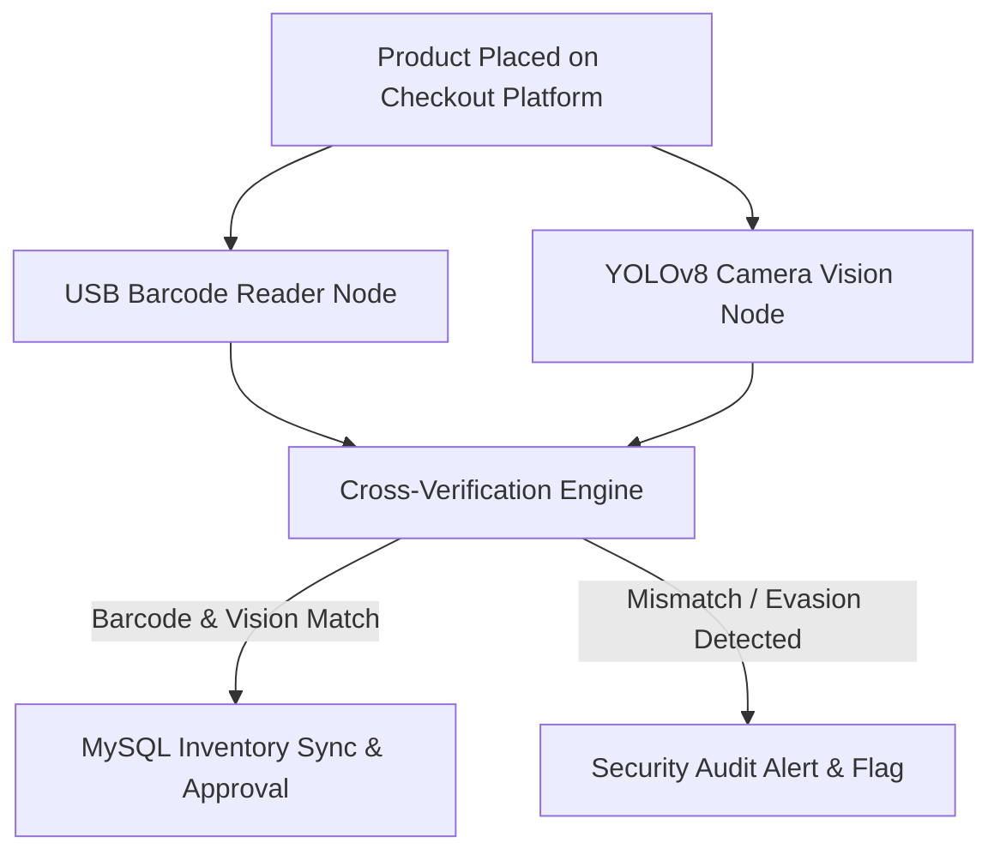
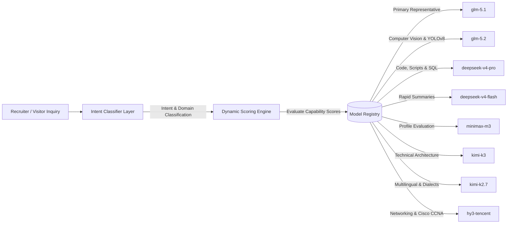

# 🚀 MUHAMMAD IRFAN FAHMI — Computer Engineering Portfolio & AI Career Agent

[](https://l3al3y.github.io/ResumeAgent/)
[](certificates/)
[](certificates/)
[-059669.svg?style=for-the-badge)](scripts/)
[](AGENTS.md)
[](resume/resume.pdf)
[-6366f1.svg?style=for-the-badge&logo=fastapi)](https://github.com/l3al3y/ResumeAgent-Backend/commit/b64deda)

> **Official Personal Engineering Portfolio & Agent-Native Application** for **MUHAMMAD IRFAN FAHMI BIN SAMSUL KAMAR**, a Computer Engineering graduate specializing in Network Engineering, IT Infrastructure, Cyber Security, Computer Vision, and Industrial AI Automation.

---

## 🌐 Quick Links & Live Application

- 🔗 **Live Web Application**: [https://l3al3y.github.io/ResumeAgent/](https://l3al3y.github.io/ResumeAgent/)
- 📄 **Printable 1-Page A4 PDF Resume**: [resume/resume.pdf](resume/resume.pdf)
- 📜 **Official Certifications**: [certificates/](certificates/)
- ⚙️ **Backend Engine Sync (Milestones 1–14)**: [https://github.com/l3al3y/ResumeAgent-Backend](https://github.com/l3al3y/ResumeAgent-Backend) `(Synced at Commit: b64deda)`

---

## 👨‍💻 Candidate Profile Summary

```text
Candidate:      MUHAMMAD IRFAN FAHMI BIN SAMSUL KAMAR
Target Roles:   Network Engineer | IT Infrastructure | IT Support | Network Security | AI Automation | Embedded Systems
Education:      B.Eng Computer Engineering (Hons) — UTeM (Expected Nov 2026)
                Diploma in Electronic Engineering (Computer) — Politeknik Port Dickson (3.26 CGPA)
                Certificate in System & Networking — Kolej Komuniti Selandar (3.58 CGPA, Best Student Award)
Certifications: Cisco CCNA (Enterprise Networking & Automation; Switching, Routing & Wireless)
                Festo Industrial Automation with AI
                Cisco Endpoint Security & Cyber Threat Management
                Fiber Optic Splicing & Polishing
Location:       Puchong, Selangor, Malaysia (Open to On-site, Hybrid, Relocation & Outstation)
Military:       Askar Wataniah (Territorial Army Reserve — High Discipline & Stress Resilience)
```

---

## 🛒 Featured Capstone Project Spotlight

### **Hybrid Self-Checkout System (Computer Vision + Barcode Integration)**

Designed to prevent item evasion and fraud in automated self-checkout systems by cross-referencing visual object detection against physical barcode scans.



#### **Key Technical Achievements & Verified Benchmarks:**
- 🧠 **Dual Verification Engine:** Integrates YOLOv8 PyTorch model with OpenCV live camera feed, USB barcode scanner (serial HID interface), and MySQL database synchronization.
- 📊 **Verified Metrics at 50 Epochs:**
  - **77.4% Precision** *(Custom local product dataset)*
  - **72.0% Recall** *(50 Epochs training)*
  - **<90ms Real-Time Camera Inference Latency**
- 📹 **Split-View Camera Fusion:** Conducted dual-view camera placement experiments to eliminate product occlusion and mitigate false negatives during scanning.

---

## 🧠 Adaptive Model Selection Engine & Intent Classifier (v2.0)

The portfolio features an upgraded **Adaptive Model Selection Engine** that intelligently routes incoming recruiter queries to specialized AI models based on intent classification and capability scoring:



### **Engine Features & Architectural Improvements:**
1. **Lightweight Intent Classifier:** Analyzes query structure to determine primary intent (`PROGRAMMING`, `NETWORKING`, `COMPUTER_VISION`, `PROFILE_EVALUATION`, `ARCHITECTURE`, `RAPID_SUMMARY`, `MULTILINGUAL`), technical domain, and confidence score.
2. **Dynamic Model Registry:** Configurable matrix of model capability profiles mapping specialties, reasoning depth (1-100), and language capabilities.
3. **Transparent Scoring Engine:** Evaluates numerical score $S(m) = \text{SpecialtyMatch} (+45) + \text{DomainAlignment} (+35) + \text{BaselineBonus} (+35) + \text{ReasoningWeight} (+15)$.
4. **Phase 2 Shadow Mode Guardrail:** `SHADOW_MODE_ACTIVE = true` guarantees **100% zero production risk**. Production traffic continues using `glm-5.1` while background telemetry logs predictions for audit.
5. **Shared Memory & Single Persona:** Shared conversation history, candidate profile (`RESUME_DATA`), and `SYSTEM_PROMPT` are preserved across all model evaluations.

---

## 🛡️ Production High Availability, Security & Knowledge Protection

- **Primary AI Provider Policy:** 100% of normal traffic is served directly by the Primary Production AI Gateway via Cloudflare Edge Worker Proxy. Zero load balancing, zero cost routing, zero latency degradation.
- **Emergency Fallback Protection:** Emergency backup (OpenRouter free models) is triggered **ONLY** during verified infrastructure outages (HTTP 500/502/503/504, 429, timeouts).
- **Forbidden Fallback Guardrail:** Switching providers is strictly **FORBIDDEN** for configuration or authorization errors (HTTP 401/403/404). Real status codes are returned directly without hiding issues.
- **Zero Secrets in Frontend:** API keys are bound exclusively in Cloudflare Worker edge environment (`env.ROOTSYS_API_KEY`).
- **Knowledge Protection & Veracity:** Stored candidate profile is the supreme source of truth. Verified credentials (**Cisco CCNA Certification = YES**) are guaranteed with 0% AI hallucination.
- **Natural Malaysian Persona:** Responds in a warm, confident, approachable Malaysian professional tone. Supports light Malaysian dialect adaptations (Kelantan, Northern, Nogori) without sacrificing clarity.

---

## 🛠️ Core Engineering Capabilities

| Domain | Key Skills & Technologies |
|---|---|
| **Networking & Infrastructure** | Cisco CCNA, OSPF, VLAN, Inter-VLAN Routing, STP, EtherChannel, TCP/IP, Wireshark, Cisco Packet Tracer, Fiber Optic Splicing |
| **IT Support & Operations** | Workstation Assembly, PC Maintenance, Windows Administration, Driver Deployment, Technical Documentation, User Support |
| **Cybersecurity** | Cisco Endpoint Security, Cyber Threat Management, Host Hardening, Firewall ACLs, Threat Mitigation, Cloudflare Turnstile |
| **Computer Vision & AI** | Python, OpenCV, YOLOv8 PyTorch, Model Fine-Tuning, Dataset Preparation, Real-Time Video Stream Inference |
| **Hardware & IoT** | Microcontrollers, Arduino, Sensors (HX711, Load Cells), EasyEDA Schematic Design, Embedded C/C++ Firmware |

---

## 📄 Printable Resume & Credentials

- 📄 **1-Page A4 Printable PDF Resume**: [`resume/resume.pdf`](resume/resume.pdf)
- 🌐 **HTML ATS Resume Mirror**: [`resume/resume.html`](resume/resume.html)
- 📜 **Verified Certificates Folder**: [`certificates/`](certificates/)

---

© 2026 **Muhammad Irfan Fahmi Bin Samsul Kamar** · Built with HTML5, Vanilla CSS3, JavaScript & Autonomous Agent Engineering.
