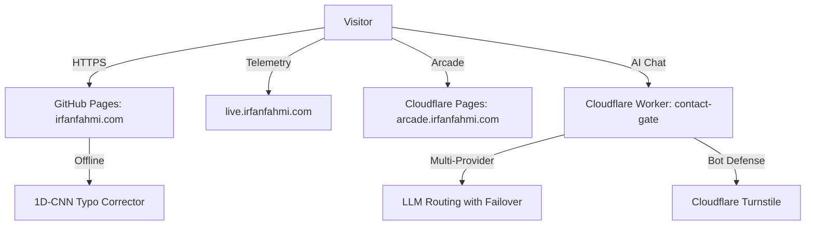

# Muhammad Irfan Fahmi — AI & Data Engineer Portfolio

<p align="center">
  <strong>AI & Data Engineer · Computer Engineering (Hons) · Cisco CCNA Certified</strong>
</p>

<p align="center">
  <a href="https://irfanfahmi.com"></a>
  <a href="https://live.irfanfahmi.com"></a>
  <a href="https://arcade.irfanfahmi.com"></a>
  <a href="https://linkedin.com/in/mifi99"></a>
</p>

<p align="center">
  
  
  
  
  
  
  
</p>

---

## About

Computer Engineering (Hons) graduate from **Universiti Teknikal Malaysia Melaka (UTeM)**. I build end-to-end AI systems — from training YOLOv8 models and building LLM agent pipelines to deploying FastAPI backends with Docker.

Based in Klang Valley, Malaysia. Open to relocation.

- 🌐 **Portfolio:** [irfanfahmi.com](https://irfanfahmi.com)
- ⚡ **Live Telemetry:** [live.irfanfahmi.com](https://live.irfanfahmi.com)
- 🎮 **Mini Arcade:** [arcade.irfanfahmi.com](https://arcade.irfanfahmi.com)
- 📄 **Resume:** [`resume/resume.pdf`](resume/resume.pdf)
- 🏅 **Credentials:** [`certificates/registry.json`](certificates/registry.json) (26 verified records)

---

## Featured Projects

### 1. 👁️ [Hybrid Self-Checkout System](https://github.com/l3al3y/FYP-PROJECT) — Computer Vision + Barcode Fusion (Capstone)
Dual-verification retail automation to detect barcode scan evasion and item swapping using real-time computer vision.
- Custom-trained **YOLOv8** model, 50 epochs on Malaysian retail items
- **77.4% Precision**, **72.0% Recall**, **<90ms** inference latency
- Dual split-view cameras, serial HID USB barcode reader, MySQL sync

### 2. 🤖 [Hermes Agent](https://live.irfanfahmi.com) — Autonomous Multi-Model AI on Edge Hardware
A 24/7 autonomous AI agent system running on a Samsung Galaxy A54 (Termux/Linux). Orchestrates multiple LLM providers with consensus-based decision making, automatic failover, and structured causal reasoning.
- Multi-LLM provider routing with consensus governance
- Causal post-mortem engine for automated error analysis
- Real-time telemetry at [live.irfanfahmi.com](https://live.irfanfahmi.com)
- Contributed to [500-AI-Agents-Projects](https://github.com/ashishpatel26/500-AI-Agents-Projects) (36k+ ★) — [PR #167](https://github.com/ashishpatel26/500-AI-Agents-Projects/pull/167)

### 3. 📖 [IrfanLLM Manga Controller](https://irfanfahmi.com/manga.html) — Touchless AI Reading Assistant
Zero-touch reading assistant powered by hand gesture recognition via front camera.
- **98.6%** cross-validation accuracy, 71D hand geometry features
- 100-tree Random Forest classifier compiled to 14.6KB JavaScript
- **<0.1ms** client-side inference, zero-recoil geometric classification
- Bookmarklet: works on any manga/webtoon site

### 4. 🎮 [Mini Arcade](https://arcade.irfanfahmi.com) — Browser Games Platform
Interactive gaming suite on Cloudflare Edge with <60ms latency.
- AI Tic Tac Toe (Minimax), Soccer Penalty, Sports Memory Match
- React, TypeScript, Tailwind CSS, Cloudflare Pages

### 5. ⚡ IoT Livestock Weight Tracking — INOTEK 2025 Award Winner
Industrial IoT platform with Arduino and calibrated HX711 strain-gauge sensors. 98%+ measurement consistency. **3rd Place at INOTEK 2025**.

---

## Certifications (26 Verified)

| Category | Count | Highlights |
| :--- | :---: | :--- |
| 🛡️ Cisco & Cybersecurity | **4** | CCNA Enterprise Networking, Switching & Routing, Endpoint Security, Cyber Threat Management |
| 🤖 Digital Upskilling & AI | **8** | Agentic AI, AI Visionary, AI Safety, Cloud, Cybersecurity, GenAI, Quantum Computing |
| ⚙️ Industrial Automation | **4** | Festo Industrial AI, Arduino, Basic IoT, Fiber Optic Splicing |
| 🎓 Academic Qualifications | **3** | B. Comp Eng (Hons) UTeM, Diploma Electronic Eng, Certificate Computer Networking |
| 🏆 Awards & Achievements | **5** | INOTEK 2025 (3rd), Best Student Award, Director's List, WiMyL Gold |
| 🎖️ Service & Experience | **2** | Military Reserve (Volunteer), 7-Eleven Professional Training |

> View all credentials at [irfanfahmi.com#certificates](https://irfanfahmi.com#certificates)

---

## Architecture


```mermaid
graph TD
    A[Visitor] -->|HTTPS| B[GitHub Pages: irfanfahmi.com]
    A -->|Telemetry| C[live.irfanfahmi.com]
    A -->|Arcade| D[Cloudflare Pages: arcade.irfanfahmi.com]
    A -->|AI Chat| E[Cloudflare Worker: contact-gate]
    E -->|Multi-Provider| F[LLM Routing with Failover]
    E -->|Bot Defense| G[Cloudflare Turnstile]
    B -->|Offline| H[1D-CNN Typo Corrector]
```

- **Frontend:** Vanilla HTML5, CSS3 (dark/light themes, glassmorphism, mobile bottom dock), ES6+ JS
- **Edge AI:** In-browser MediaPipe Hands + Random Forest classifier via WebRTC
- **Backend:** [Portfolio-Backend](https://github.com/l3al3y/Portfolio-Backend) — Cloudflare Worker with rate-limited AI chat, Turnstile verification, multi-model failover
- **Offline:** Built-in 1D-CNN ensures chatbot responds during network downtime

---

## Local Development

```bash
git clone https://github.com/l3al3y/Portfolio.git
cd Portfolio
python -m http.server 8000
# Open http://localhost:8000
```

---

## Project Structure

```
Portfolio/
├── index.html              # Portfolio page with SEO meta
├── manga.html              # Touchless reader demo
├── manga.js                # Random Forest vision controller
├── style.css               # Styling, animations, mobile dock
├── app.js                  # AI chatbot, 3D canvas, UI logic
├── certificates/           # PDF certs + registry.json (26 records)
├── resume/resume.pdf       # Official resume
└── assets/                 # Thumbnails, OG preview, icons
    ├── og-preview.png
    ├── thumb-yolov8.png
    ├── thumb-hermes.png
    ├── thumb-arcade.png
    └── thumb-irfanllm.png
```

---

## Contact

- 🌐 [irfanfahmi.com](https://irfanfahmi.com)
- 💼 [linkedin.com/in/mifi99](https://linkedin.com/in/mifi99)
- 🐙 [github.com/l3al3y](https://github.com/l3al3y)
- 📍 Klang Valley, Malaysia (open to relocation)

<p align="center">
  <sub>Muhammad Irfan Fahmi © 2026</sub>
</p>
